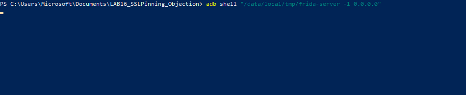
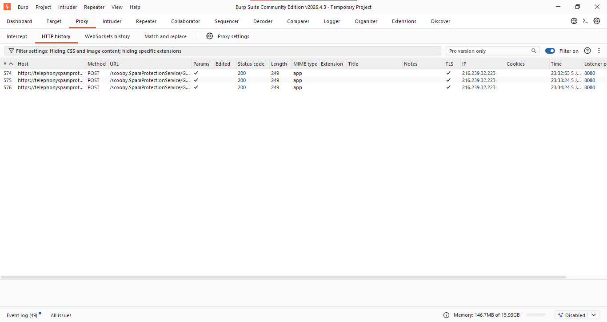
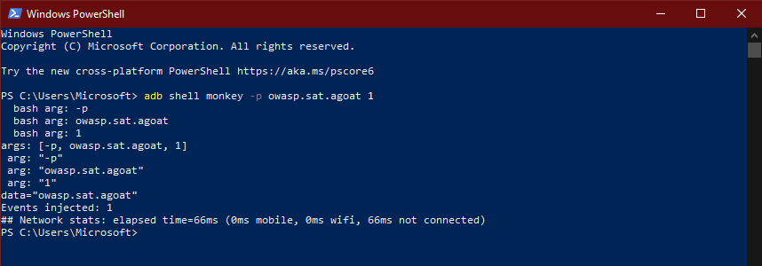
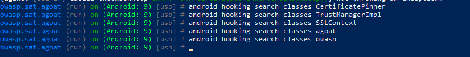

# 🔐 LAB 16 — Inspection HTTPS Android  
## Désactivation du SSL Pinning avec Objection + Burp Suite

<p align="center">
  <b>Frida · Objection · Burp Suite · Android Emulator · SSL Pinning Bypass · AndroGoat</b>
</p>

<p align="center">
  
  
  
  
  
</p>

<p align="center">
  <b>Objectif :</b> intercepter le trafic HTTPS d’une application Android après désactivation dynamique du SSL Pinning.
</p>

---

## 📌 Objectif du lab

Ce laboratoire consiste à mettre en place une chaîne complète d’inspection HTTPS sur Android avec **Burp Suite**, puis à désactiver dynamiquement le **SSL Pinning** d’une application cible avec **Objection**, basé sur **Frida**.

L’objectif principal est de démontrer que le trafic HTTPS d’une application Android peut être observé dans Burp Suite après injection de hooks SSL/TLS dans l’application.

---

## ⚠️ Cadre éthique

Ce lab a été réalisé uniquement dans un environnement contrôlé :

- Émulateur Android personnel ;
- Application volontairement vulnérable ;
- Proxy local Burp Suite ;
- Aucune cible réelle ou non autorisée.

L’application utilisée est **AndroGoat**, une application Android éducative conçue pour l’apprentissage de la sécurité mobile.

---

## 🧠 Résumé du scénario

```text
PC Windows
│
├── Burp Suite écoute sur le port 8080
│
├── Android Emulator utilise le proxy 10.0.2.2:8080
│
├── Burp CA installée dans le magasin système Android
│
├── Frida Server lancé sur l’émulateur
│
└── Objection injecté dans AndroGoat
    │
    └── android sslpinning disable
        │
        └── Requête HTTPS visible dans Burp Suite
```

---

## 🛠️ Environnement utilisé

| Élément | Valeur |
|---|---|
| Système hôte | Windows 10 |
| Émulateur | Pixel 2 XL API 28 |
| Version Android | Android 9 |
| Architecture Android | `x86_64` |
| Proxy | Burp Suite Community Edition |
| Port proxy | `8080` |
| Proxy Android | `10.0.2.2:8080` |
| Frida PC | `17.10.1` |
| Frida Server | `17.10.1 Android x86_64` |
| Objection | `1.12.5` |
| Application cible | AndroGoat |
| Package cible | `owasp.sat.agoat` |

---

## 📁 Structure du projet

```text
LAB16_SSLPinning_Objection/
│
├── README.md
├── .gitignore
│
├── commands/
│   └── commands.txt
│
├── notes/
│   └── journal_lab16.txt
│
└── screenshots/
    ├── adb_devices.png
    ├── adb_monkey.png
    ├── adb_root_shell_id.png
    ├── androgoat_install.png
    ├── androgoat_interface.png
    ├── androgoat_launch_interface.png
    ├── androgoat_okhttp3_after_objection.png
    ├── androgoat_package.png
    ├── android_cpu_architecture.png
    ├── android_proxy_adb_configured.png
    ├── Burp_CA-download.png
    ├── Burp_CA_installed.png
    ├── burp_https-history_browser.png
    ├── Burp_proxy_listener.png
    ├── burp_scoobyspamprotection.png
    ├── converting_Burp-CA_to_Android-system-format.png
    ├── exploration_commands.png
    ├── frida-server_launch.png
    ├── frida-server_push_chmod.png
    ├── frida_objection_pip-versions.png
    ├── frida_ps-Uai.png
    ├── http_burp.png
    ├── lancement_frida-server.png
    ├── objection_help_sslpinning.png
    ├── objection_jobs_list_sslpinning.png
    ├── objection_search.png
    ├── objection_spawn_sslpinning_disable.png
    └── python_pip_adb-versions.png
```

Les fichiers binaires et temporaires ne sont pas inclus dans le dépôt GitHub :

```text
frida-server
frida-server-17.10.1-android-x86_64.xz
AndroGoat.apk
cacert.der
cacert.pem
9a5ba575.0
```

---

## 1️⃣ Vérification des prérequis

Les premières vérifications ont porté sur Python, pip et ADB.

```powershell
python --version
pip --version
adb version
```

<p align="center">
  
</p>

Cette étape confirme que Python, pip et ADB sont disponibles sur la machine Windows.

---

## 2️⃣ Installation de Frida et Objection

Installation côté PC :

```powershell
python -m pip install --upgrade frida frida-tools objection
```

Vérification des versions :

```powershell
frida --version
frida-ps --version
python -m pip show objection
```

<p align="center">
  
</p>

La commande suivante n’était pas disponible dans cette installation :

```powershell
objection --version
```

La version d’Objection a donc été vérifiée avec :

```powershell
python -m pip show objection
```

---

## 3️⃣ Détection de l’émulateur Android

L’émulateur a été détecté avec ADB :

```powershell
adb devices
```

<p align="center">
  
</p>

L’architecture CPU Android a ensuite été identifiée :

```powershell
adb shell getprop ro.product.cpu.abi
```

Résultat obtenu :

```text
x86_64
```

<p align="center">
  
</p>

L’architecture `x86_64` impose l’utilisation du binaire Frida suivant :

```text
frida-server-17.10.1-android-x86_64
```

---

## 4️⃣ Préparation de l’émulateur rooté

L’émulateur a été lancé en mode root :

```powershell
adb root
adb shell id
```

<p align="center">
  
</p>

Le résultat confirme que l’émulateur fonctionne avec les privilèges root.

---

## 5️⃣ Installation et lancement de Frida Server

Le serveur Frida a été transféré dans `/data/local/tmp/`, puis rendu exécutable :

```powershell
adb push .\frida-server /data/local/tmp/frida-server
adb shell chmod 755 /data/local/tmp/frida-server
adb shell ls -l /data/local/tmp/frida-server
```

<p align="center">
  
</p>

Frida Server a ensuite été lancé sur l’émulateur :

```powershell
adb shell "/data/local/tmp/frida-server -l 0.0.0.0"
```

<p align="center">
  
</p>

Une seconde capture montre également le lancement du serveur Frida :

<p align="center">
  
</p>

Dans une deuxième fenêtre PowerShell, les ports Frida ont été redirigés :

```powershell
adb forward tcp:27042 tcp:27042
adb forward tcp:27043 tcp:27043
frida-ps -Uai
```

<p align="center">
  
</p>

Cette étape confirme que Frida communique correctement avec l’émulateur Android.

---

## 6️⃣ Configuration de Burp Suite

Burp Suite a été configuré avec un proxy listener sur le port `8080`.

<p align="center">
  
</p>

Sur Android Emulator, l’adresse `10.0.2.2` permet d’accéder à la machine hôte.  
Le proxy Android a donc été configuré avec ADB :

```powershell
adb shell settings put global http_proxy 10.0.2.2:8080
adb shell settings get global http_proxy
```

Résultat attendu :

```text
10.0.2.2:8080
```

<p align="center">
  
</p>

---

## 7️⃣ Vérification de l’accès à Burp depuis Android

Depuis Chrome Android, l’URL suivante a été ouverte :

```text
http://burp
```

<p align="center">
  
  
</p>

Cette étape confirme que l’émulateur utilise bien Burp Suite comme proxy.

---

## 8️⃣ Problème rencontré : installation classique de la CA Burp

L’installation classique du certificat Burp via l’interface Android a échoué avec le message suivant :

```text
Couldn't install because the certificate file couldn't be read.
```

Cette erreur a été contournée en installant la CA Burp directement dans le magasin système Android.

---

## 9️⃣ Conversion de la CA Burp au format Android

Le certificat Burp téléchargé a été récupéré depuis l’émulateur :

```powershell
adb pull /sdcard/Download/cacert.der .\cacert.der
```

Le certificat a ensuite été converti du format DER vers le format PEM :

```powershell
openssl x509 -inform DER -in cacert.der -out cacert.pem
```

Le hash attendu par Android a été généré avec OpenSSL :

```powershell
openssl x509 -inform PEM -subject_hash_old -in cacert.pem -noout
```

Résultat obtenu :

```text
9a5ba575
```

Le certificat final a donc été nommé :

```text
9a5ba575.0
```

<p align="center">
  
</p>

---

## 🔟 Installation de la CA dans le magasin système Android

La première tentative de copie dans `/system/etc/security/cacerts/` a échoué car la partition système était montée en lecture seule.

Pour corriger cela, l’émulateur a été relancé avec un système modifiable, puis la commande `adb remount` a réussi.

```powershell
adb root
adb disable-verity
adb reboot
adb wait-for-device
adb root
adb remount
```

Le certificat a ensuite été copié dans le magasin système Android :

```powershell
adb push .\9a5ba575.0 /system/etc/security/cacerts/
adb shell chmod 644 /system/etc/security/cacerts/9a5ba575.0
adb shell ls -l /system/etc/security/cacerts/9a5ba575.0
```

Résultat obtenu :

```text
-rw-r--r-- 1 root root 1414 /system/etc/security/cacerts/9a5ba575.0
```

<p align="center">
  
</p>

Après redémarrage de l’émulateur, le proxy Android a été remis en place :

```powershell
adb shell settings put global http_proxy 10.0.2.2:8080
adb shell settings get global http_proxy
```

---

## 1️⃣1️⃣ Validation HTTPS avec Chrome Android

Avant de tester l’application cible, une requête HTTPS simple a été générée depuis Chrome Android :

```powershell
adb shell am start -a android.intent.action.VIEW -d "https://example.com"
```

Dans Burp Suite, le trafic HTTPS apparaît dans l’onglet `HTTP history`.

<p align="center">
  
</p>

Cette étape valide les points suivants :

```text
[✓] Proxy Android configuré
[✓] Burp reçoit le trafic de l’émulateur
[✓] CA Burp reconnue par Android
[✓] Interception HTTPS fonctionnelle
```

Une autre capture montre également du trafic HTTPS de fond provenant de l’émulateur :

<p align="center">
  
</p>

Cette capture sert uniquement de preuve complémentaire que Burp reçoit bien du trafic HTTPS depuis Android.

---

## 1️⃣2️⃣ Installation d’AndroGoat

L’application cible utilisée est **AndroGoat**, une application volontairement vulnérable pour l’apprentissage de la sécurité Android.

Installation de l’APK :

```powershell
adb install .\AndroGoat.apk
```

<p align="center">
  
</p>

Identification du package de l’application :

```powershell
adb shell pm list packages -3
```

Package obtenu :

```text
owasp.sat.agoat
```

<p align="center">
  
</p>

---

## 1️⃣3️⃣ Lancement d’AndroGoat

L’application a été lancée avec la commande `monkey` :

```powershell
adb shell monkey -p owasp.sat.agoat 1
```

<p align="center">
  
</p>

Interface principale d’AndroGoat :

<p align="center">
  
  
</p>

---

## 1️⃣4️⃣ Désactivation du SSL Pinning avec Objection

L’application a été lancée avec Objection en mode `spawn`, afin d’injecter l’agent dès le démarrage :

```powershell
objection -g owasp.sat.agoat explore --startup-command "android sslpinning disable"
```

Sortie obtenue :

```text
(agent) Custom TrustManager ready, overriding SSLContext.init()
(agent) Found okhttp3.CertificatePinner, overriding CertificatePinner.check()
(agent) Found okhttp3.CertificatePinner, overriding CertificatePinner.check$okhttp()
(agent) Found com.android.org.conscrypt.TrustManagerImpl, overriding TrustManagerImpl.verifyChain()
(agent) Found com.android.org.conscrypt.TrustManagerImpl, overriding TrustManagerImpl.checkTrustedRecursive()
(agent) Registering job 301427. Name: android-sslpinning-disable
```

<p align="center">
  
</p>

Cette sortie confirme que plusieurs composants liés à la validation TLS/SSL ont été hookés dynamiquement, notamment :

```text
SSLContext.init()
okhttp3.CertificatePinner.check()
TrustManagerImpl.verifyChain()
```

---

## 1️⃣5️⃣ Vérification du hook actif

Dans la console Objection, la commande suivante a été exécutée :

```text
jobs list
```

Résultat obtenu :

```text
Job ID  Type  Name
------  ----  --------------------------
301427  hook  android-sslpinning-disable
```

<p align="center">
  
</p>

Cela confirme que le hook `android-sslpinning-disable` est actif pendant l’exécution de l’application.

---

## 1️⃣6️⃣ Exercice AndroGoat utilisé

Dans AndroGoat, l’exercice utilisé se trouve dans :

```text
Network Intercepting
```

Puis :

```text
Certificate Pinning - OkHttp3
```

<p align="center">
  
  
</p>

Le choix de l’exercice **Certificate Pinning - OkHttp3** est cohérent avec la sortie Objection, qui indique la présence de hooks sur :

```text
okhttp3.CertificatePinner.check()
okhttp3.CertificatePinner.check$okhttp()
```

---

## 1️⃣7️⃣ Validation finale dans Burp Suite

Après l’exécution de la commande :

```text
android sslpinning disable
```

une requête HTTPS générée depuis l’exercice **Certificate Pinning - OkHttp3** d’AndroGoat est devenue visible dans Burp Suite.

<p align="center">
  
</p>

La requête observée dans Burp Suite présente les éléments suivants :

```text
Host: https://wasp.org
Method: GET
Status: 200
TLS: enabled
```

Cette capture valide que le trafic HTTPS de l’application cible est visible dans le proxy après désactivation dynamique du SSL Pinning.

---

## 🧪 Commandes Objection complémentaires

La commande d’aide SSL pinning a été testée :

```text
help android sslpinning
```

<p align="center">
  
</p>

Des commandes d’exploration ont également été testées :

```text
android hooking search classes okhttp
android hooking search classes pin
android hooking search classes trust
android hooking search classes CertificatePinner
android hooking search classes TrustManagerImpl
android hooking search classes SSLContext
android hooking search classes agoat
android hooking search classes owasp
```

<p align="center">
  
</p>

Une autre capture regroupe les recherches effectuées :

<p align="center">
  
</p>

Ces commandes n’ont pas retourné de résultat exploitable dans cette session.  
Cependant, cela ne bloque pas la validation du lab, car Objection avait déjà confirmé l’installation des hooks SSL pinning au moment de l’injection, et la commande `jobs list` confirme que le hook est actif.

---

## 🧩 Problèmes rencontrés et solutions

### Problème 1 — `objection --version` non reconnu

La commande suivante n’était pas disponible :

```powershell
objection --version
```

Solution utilisée :

```powershell
python -m pip show objection
```

---

### Problème 2 — Écran noir de l’émulateur

L’émulateur est devenu noir et peu réactif à certains moments.

Commandes utilisées pour le réveiller et éviter la mise en veille :

```powershell
adb shell input keyevent 224
adb shell wm dismiss-keyguard
adb shell input keyevent 3
adb shell svc power stayon true
adb shell settings put system screen_off_timeout 2147483647
```

---

### Problème 3 — Certificat Burp non installable via l’interface Android

Message rencontré :

```text
Couldn't install because the certificate file couldn't be read.
```

Solution appliquée :

```text
Conversion du certificat Burp avec OpenSSL, puis installation dans le magasin système Android.
```

---

### Problème 4 — Partition système en lecture seule

Erreur rencontrée lors du remount :

```text
remount of the / superblock failed: Permission denied
remount failed
```

Solution appliquée :

```text
Relancement de l’émulateur avec un système modifiable, puis exécution de adb remount.
```

---

## ✅ Résultats obtenus

| Test | Résultat |
|---|---|
| ADB détecte l’émulateur | ✅ Réussi |
| Architecture Android identifiée | ✅ `x86_64` |
| Frida PC installé | ✅ `17.10.1` |
| Objection installé | ✅ `1.12.5` |
| Frida Server transféré sur Android | ✅ Réussi |
| Frida Server lancé | ✅ Réussi |
| Burp configuré comme proxy | ✅ Réussi |
| Proxy Android configuré | ✅ `10.0.2.2:8080` |
| CA Burp convertie au format Android | ✅ Réussi |
| CA Burp installée dans Android | ✅ Réussi |
| HTTPS navigateur visible dans Burp | ✅ Réussi |
| AndroGoat installé | ✅ Réussi |
| Package cible identifié | ✅ `owasp.sat.agoat` |
| Objection injecté dans AndroGoat | ✅ Réussi |
| SSL Pinning désactivé | ✅ Réussi |
| Hook Objection actif | ✅ Réussi |
| Requête HTTPS AndroGoat visible dans Burp | ✅ Réussi |

---

## 🧾 Captures importantes

| Étape | Capture |
|---|---|
| Versions Python / pip / ADB | `screenshots/python_pip_adb-versions.png` |
| Versions Frida / Objection | `screenshots/frida_objection_pip-versions.png` |
| ADB devices | `screenshots/adb_devices.png` |
| Architecture Android | `screenshots/android_cpu_architecture.png` |
| Root Android | `screenshots/adb_root_shell_id.png` |
| Push + chmod Frida Server | `screenshots/frida-server_push_chmod.png` |
| Lancement Frida Server | `screenshots/frida-server_launch.png` |
| Processus Frida | `screenshots/frida_ps-Uai.png` |
| Listener Burp | `screenshots/Burp_proxy_listener.png` |
| Proxy Android | `screenshots/android_proxy_adb_configured.png` |
| Page Burp Android | `screenshots/http_burp.png` |
| Téléchargement CA Burp | `screenshots/Burp_CA-download.png` |
| Conversion CA Burp | `screenshots/converting_Burp-CA_to_Android-system-format.png` |
| Installation CA système | `screenshots/Burp_CA_installed.png` |
| HTTPS navigateur dans Burp | `screenshots/burp_https-history_browser.png` |
| Installation AndroGoat | `screenshots/androgoat_install.png` |
| Package AndroGoat | `screenshots/androgoat_package.png` |
| Interface AndroGoat | `screenshots/androgoat_interface.png` |
| Objection SSL Pinning disable | `screenshots/objection_spawn_sslpinning_disable.png` |
| Hook actif Objection | `screenshots/objection_jobs_list_sslpinning.png` |
| Validation finale Burp | `screenshots/androgoat_okhttp3_after_objection.png` |

---

## 🧹 Nettoyage après le lab

Désactivation du proxy Android :

```powershell
adb shell settings put global http_proxy :0
adb shell settings delete global http_proxy
adb shell settings get global http_proxy
```

Arrêt de Frida Server :

```powershell
adb shell pkill frida-server
```

---

## 📌 Conclusion

Ce lab a permis de mettre en place une chaîne complète d’inspection HTTPS sur Android :

```text
Burp Suite + Proxy Android + CA système + Frida Server + Objection + AndroGoat
```

La désactivation dynamique du SSL Pinning a été validée grâce à Objection, qui a installé des hooks sur plusieurs composants liés à la validation TLS :

```text
SSLContext.init()
okhttp3.CertificatePinner.check()
TrustManagerImpl.verifyChain()
```

La commande `jobs list` a confirmé que le hook `android-sslpinning-disable` était actif dans le processus de l’application cible.

Enfin, la requête HTTPS générée par l’exercice **Certificate Pinning - OkHttp3** d’AndroGoat a été capturée avec succès dans Burp Suite avec un statut `200`.

Le lab est donc validé.

---

## 👩‍💻 Réalisé par

**Malak BELKHO**  
Cycle Ingénieur — Cyberdéfense & Systèmes de Télécommunications Embarqués  
ENSA Marrakech

---
