# 🔐 LAB 16 — Inspection HTTPS Android  
## Désactivation du SSL Pinning avec Objection + Burp Suite

<p align="center">
  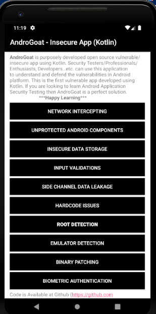
  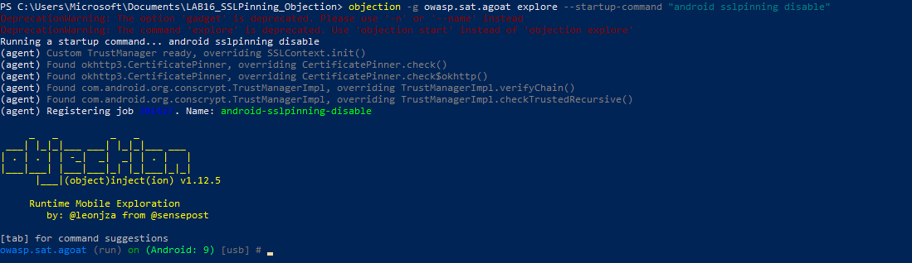
</p>

<p align="center">
  <b>Frida · Objection · Burp Suite · Android Emulator · SSL Pinning Bypass · AndroGoat</b>
</p>

<p align="center">
  
  
  
  
</p>

---

## 📌 Objectif du lab

Ce laboratoire a pour objectif de mettre en place une inspection HTTPS sur une application Android en utilisant un proxy d’interception, puis de désactiver dynamiquement le **SSL Pinning** avec **Objection**, une surcouche basée sur Frida.

L’objectif principal est de démontrer que le trafic HTTPS d’une application Android peut être observé dans **Burp Suite** après injection de hooks SSL/TLS dans l’application cible.

---

## ⚠️ Cadre éthique

Ce lab a été réalisé uniquement dans un environnement contrôlé, sur un émulateur Android et avec une application volontairement vulnérable destinée à l’apprentissage.

L’application utilisée est **AndroGoat**, une application Android éducative contenant plusieurs vulnérabilités de sécurité.

Aucune application réelle, service externe privé ou cible non autorisée n’a été testé.

---

## 🧠 Résumé du scénario

```text
PC Windows
│
├── Burp Suite écoute sur le port 8080
│
├── Android Emulator utilise le proxy 10.0.2.2:8080
│
├── Burp CA installée dans le magasin système Android
│
├── Frida Server lancé sur l’émulateur
│
└── Objection injecté dans AndroGoat
    │
    └── android sslpinning disable
        │
        └── Requête HTTPS visible dans Burp Suite
```

---

## 🛠️ Environnement utilisé

| Élément | Valeur |
|---|---|
| Système hôte | Windows 10 |
| Émulateur | Pixel 2 XL API 28 |
| Version Android | Android 9 |
| Architecture Android | `x86_64` |
| Proxy | Burp Suite Community Edition |
| Port proxy | `8080` |
| Proxy Android | `10.0.2.2:8080` |
| Frida PC | `17.10.1` |
| Frida Server | `17.10.1 Android x86_64` |
| Objection | `1.12.5` |
| Application cible | AndroGoat |
| Package cible | `owasp.sat.agoat` |

---

## 📁 Structure du projet

```text
LAB16_SSLPinning_Objection/
│
├── README.md
├── .gitignore
│
├── commands/
│   └── commands.txt
│
├── notes/
│   └── journal_lab16.txt
│
└── screenshots/
    ├── python_pip_adb-versions.png
    ├── frida_objection_pip-versions.png
    ├── adb_devices.png
    ├── android_cpu_architecture.png
    ├── adb_root_shell_id.png
    ├── frida-server_push_chmod.png
    ├── frida_ps-Uai.png
    ├── Burp_proxy_listener.png
    ├── android_proxy_adb_configured.png
    ├── Burp_CA_installed.png
    ├── objection_spawn_sslpinning_disable.png
    ├── objection_jobs_list_sslpinning.png
    └── androgoat_okhttp3_after_objection.png
```

Les fichiers binaires comme `frida-server`, `AndroGoat.apk` et les certificats Burp ne sont pas inclus dans le dépôt GitHub.

---

## 1️⃣ Vérification des prérequis

Les premières vérifications ont porté sur Python, pip et ADB.

```powershell
python --version
pip --version
adb version
```

Résultat obtenu :

<p align="center">
  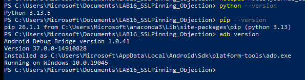
</p>

---

## 2️⃣ Installation de Frida et Objection

Installation côté PC :

```powershell
python -m pip install --upgrade frida frida-tools objection
```

Vérification des versions :

```powershell
frida --version
frida-ps --version
python -m pip show objection
```

Résultat obtenu :

<p align="center">
  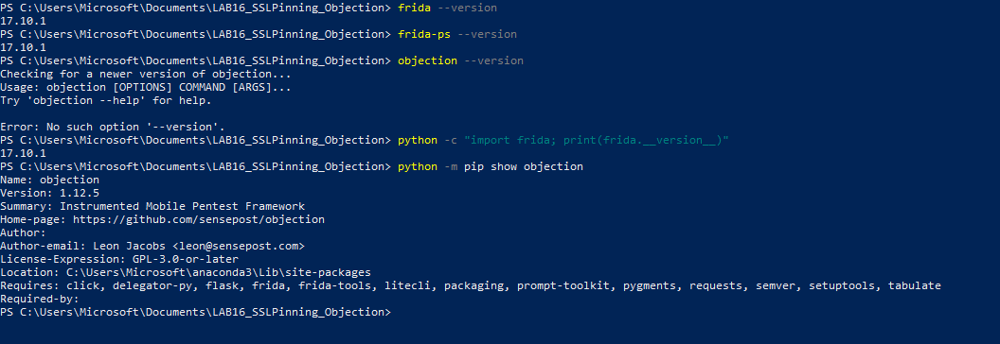
</p>

Remarque : la commande suivante n’était pas disponible dans cette installation :

```powershell
objection --version
```

La version d’Objection a donc été vérifiée avec :

```powershell
python -m pip show objection
```

---

## 3️⃣ Détection de l’émulateur Android

L’émulateur a été détecté avec ADB :

```powershell
adb devices
```

Puis l’architecture CPU Android a été identifiée :

```powershell
adb shell getprop ro.product.cpu.abi
```

Résultat obtenu :

```text
x86_64
```

<p align="center">
  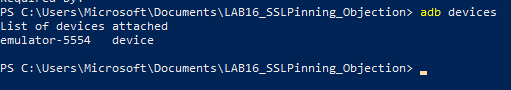
  <br/>
  
</p>

L’architecture `x86_64` impose l’utilisation du binaire suivant :

```text
frida-server-17.10.1-android-x86_64
```

---

## 4️⃣ Préparation et lancement de Frida Server

L’émulateur a d’abord été lancé en mode root :

```powershell
adb root
adb shell id
```

Résultat :

<p align="center">
  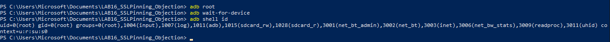
</p>

Le serveur Frida a ensuite été copié dans `/data/local/tmp/`, puis rendu exécutable :

```powershell
adb push .\frida-server /data/local/tmp/frida-server
adb shell chmod 755 /data/local/tmp/frida-server
adb shell ls -l /data/local/tmp/frida-server
```

<p align="center">
  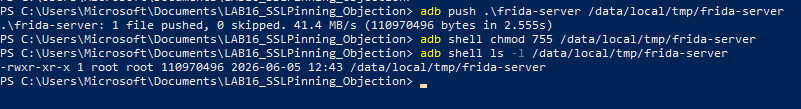
</p>

Lancement de Frida Server :

```powershell
adb shell "/data/local/tmp/frida-server -l 0.0.0.0"
```

<p align="center">
  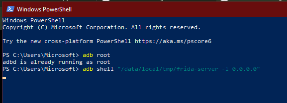
</p>

Dans une deuxième fenêtre PowerShell, les ports Frida ont été redirigés :

```powershell
adb forward tcp:27042 tcp:27042
adb forward tcp:27043 tcp:27043
frida-ps -Uai
```

<p align="center">
  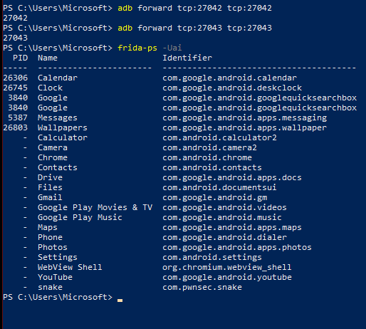
</p>

Cette étape confirme que Frida communique correctement avec l’émulateur Android.

---

## 5️⃣ Configuration de Burp Suite

Burp Suite a été configuré avec un listener sur le port `8080`.

<p align="center">
  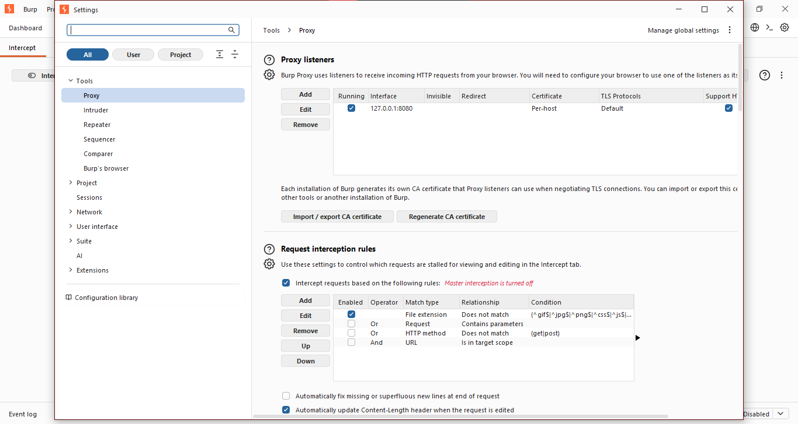
</p>

Sur Android Emulator, l’adresse `10.0.2.2` permet de joindre la machine hôte.  
Le proxy Android a donc été configuré ainsi :

```powershell
adb shell settings put global http_proxy 10.0.2.2:8080
adb shell settings get global http_proxy
```

Résultat attendu :

```text
10.0.2.2:8080
```

<p align="center">
  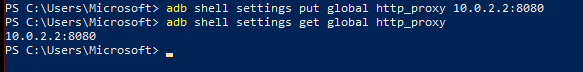
</p>

---

## 6️⃣ Accès à la page Burp depuis Android

Depuis Chrome Android, l’URL suivante a été ouverte :

```text
http://burp
```

<p align="center">
  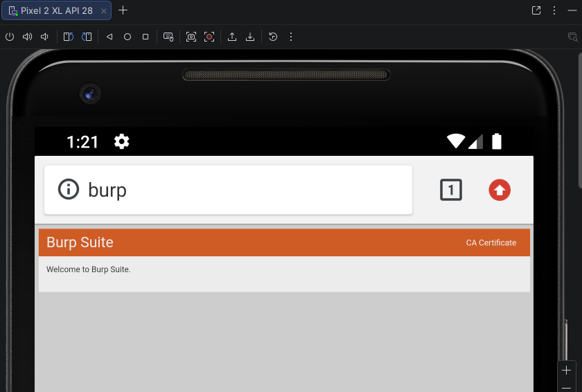
  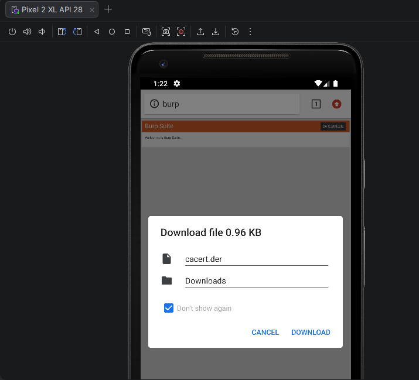
</p>

Cette étape confirme que l’émulateur utilise bien Burp Suite comme proxy.

---

## 7️⃣ Problème rencontré : installation classique de la CA Burp

L’installation classique du certificat Burp via l’interface Android a échoué avec le message suivant :

```text
Couldn't install because the certificate file couldn't be read.
```

<p align="center">
  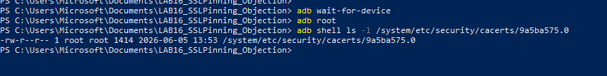
</p>

Cette erreur a été contournée en installant la CA Burp directement dans le magasin système Android.

---

## 8️⃣ Conversion de la CA Burp au format Android

Le certificat Burp téléchargé a été récupéré depuis l’émulateur :

```powershell
adb pull /sdcard/Download/cacert.der .\cacert.der
```

Conversion du certificat DER en PEM :

```powershell
openssl x509 -inform DER -in cacert.der -out cacert.pem
```

Récupération du hash attendu par Android :

```powershell
openssl x509 -inform PEM -subject_hash_old -in cacert.pem -noout
```

Résultat obtenu :

```text
9a5ba575
```

Le certificat final a donc été nommé :

```text
9a5ba575.0
```

<p align="center">
  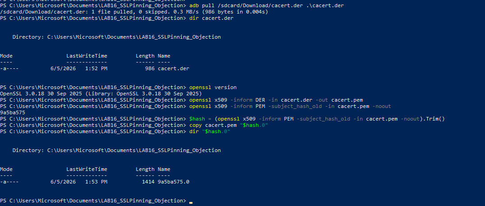
</p>

---

## 9️⃣ Installation de la CA dans le magasin système Android

La première tentative de copie dans `/system/etc/security/cacerts/` a échoué car la partition système était montée en lecture seule.

Pour résoudre cela, l’émulateur a été relancé en mode système modifiable, puis la commande `adb remount` a réussi.

```powershell
adb root
adb disable-verity
adb reboot
adb wait-for-device
adb root
adb remount
```

Ensuite, le certificat a été copié dans le magasin système Android :

```powershell
adb push .\9a5ba575.0 /system/etc/security/cacerts/
adb shell chmod 644 /system/etc/security/cacerts/9a5ba575.0
adb shell ls -l /system/etc/security/cacerts/9a5ba575.0
```

Résultat obtenu :

```text
-rw-r--r-- 1 root root 1414 /system/etc/security/cacerts/9a5ba575.0
```

<p align="center">
  
</p>

Après redémarrage, le proxy a été remis en place :

```powershell
adb shell settings put global http_proxy 10.0.2.2:8080
adb shell settings get global http_proxy
```

---

## 🔟 Validation HTTPS avec navigateur

Avant de tester l’application cible, une requête HTTPS simple a été testée depuis Chrome Android.

```powershell
adb shell am start -a android.intent.action.VIEW -d "https://example.com"
```

Dans Burp Suite, le trafic HTTPS est visible dans l’onglet `HTTP history`.

<p align="center">
  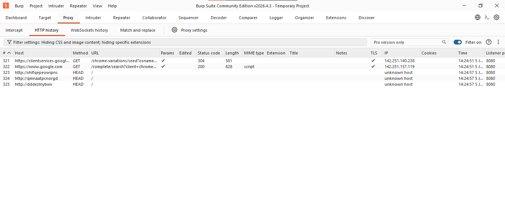
</p>

Cette étape valide :

```text
[✓] Proxy Android configuré
[✓] Burp reçoit le trafic
[✓] CA Burp reconnue par Android
[✓] Interception HTTPS fonctionnelle
```

---

## 1️⃣1️⃣ Installation et lancement d’AndroGoat

L’application cible utilisée est **AndroGoat**, une application volontairement vulnérable pour l’apprentissage de la sécurité Android.

Installation :

```powershell
adb install .\AndroGoat.apk
```

<p align="center">
  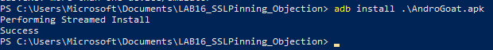
</p>

Identification du package :

```powershell
adb shell pm list packages -3
```

Package utilisé :

```text
owasp.sat.agoat
```

<p align="center">
  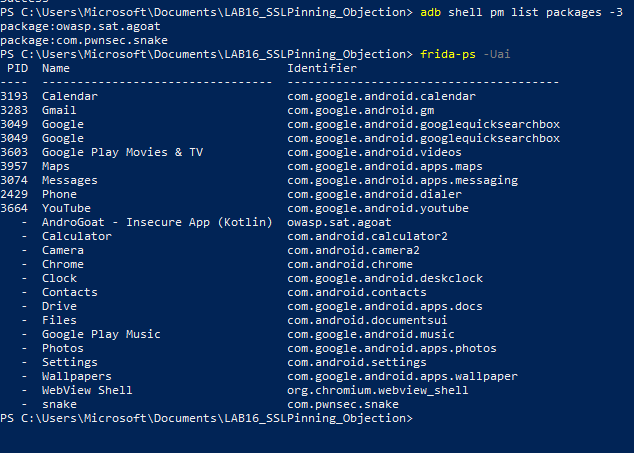
</p>

Lancement de l’application :

```powershell
adb shell monkey -p owasp.sat.agoat 1
```

<p align="center">
  
  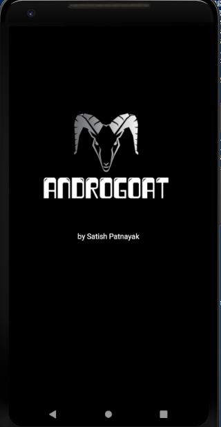
</p>

---

## 1️⃣2️⃣ Désactivation du SSL Pinning avec Objection

L’application a été lancée avec Objection en mode `spawn`, afin d’injecter l’agent dès le démarrage :

```powershell
objection -g owasp.sat.agoat explore --startup-command "android sslpinning disable"
```

Résultat obtenu :

```text
(agent) Custom TrustManager ready, overriding SSLContext.init()
(agent) Found okhttp3.CertificatePinner, overriding CertificatePinner.check()
(agent) Found okhttp3.CertificatePinner, overriding CertificatePinner.check$okhttp()
(agent) Found com.android.org.conscrypt.TrustManagerImpl, overriding TrustManagerImpl.verifyChain()
(agent) Found com.android.org.conscrypt.TrustManagerImpl, overriding TrustManagerImpl.checkTrustedRecursive()
(agent) Registering job 301427. Name: android-sslpinning-disable
```

<p align="center">
  
</p>

Cette sortie confirme que plusieurs mécanismes liés à la validation TLS/SSL ont été hookés dynamiquement.

---

## 1️⃣3️⃣ Vérification du hook actif

Dans la console Objection, la commande suivante a été exécutée :

```text
jobs list
```

Résultat obtenu :

```text
Job ID  Type  Name
------  ----  --------------------------
301427  hook  android-sslpinning-disable
```

<p align="center">
  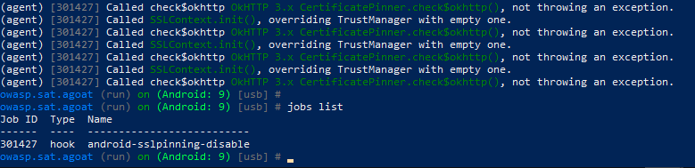
</p>

Cela confirme que le hook `android-sslpinning-disable` est actif pendant l’exécution de l’application.

---

## 1️⃣4️⃣ Exercice AndroGoat utilisé

Dans AndroGoat, l’exercice utilisé se trouve dans :

```text
Network Intercepting
```

Puis :

```text
Certificate Pinning - OkHttp3
```

<p align="center">
  
  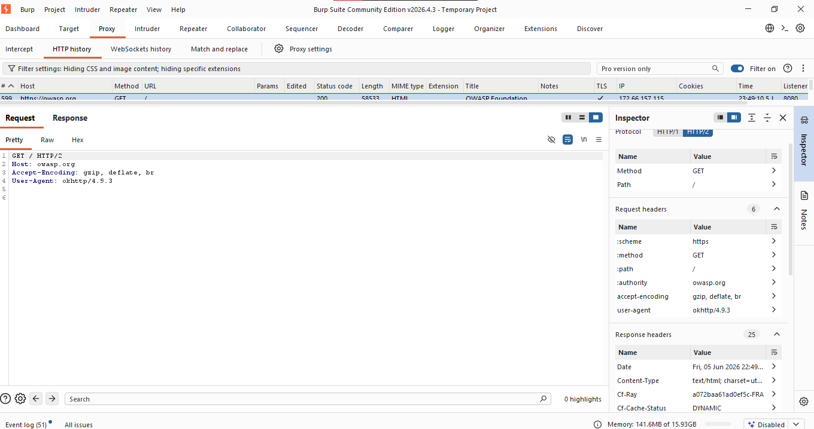
</p>

Cette partie correspond directement aux hooks détectés par Objection :

```text
okhttp3.CertificatePinner.check()
okhttp3.CertificatePinner.check$okhttp()
```

---

## 1️⃣5️⃣ Validation finale dans Burp Suite

Après exécution de `android sslpinning disable`, une requête HTTPS générée depuis l’exercice **Certificate Pinning - OkHttp3** d’AndroGoat est devenue visible dans Burp Suite.

<p align="center">
  
</p>

La requête observée dans Burp :

```text
Host: https://wasp.org
Method: GET
Status: 200
TLS: enabled
```

Cette capture valide que le trafic HTTPS de l’application cible est visible dans le proxy après désactivation dynamique du SSL Pinning.

---

## 🧪 Commandes Objection complémentaires

La commande d’aide SSL pinning a été testée :

```text
help android sslpinning
```

<p align="center">
  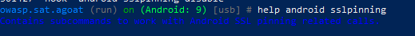
</p>

Des recherches de classes ont aussi été testées :

```text
android hooking search classes okhttp
android hooking search classes pin
android hooking search classes trust
android hooking search classes CertificatePinner
android hooking search classes TrustManagerImpl
android hooking search classes SSLContext
```

<p align="center">
  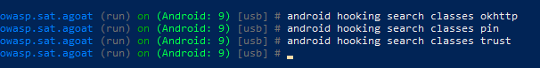
</p>

Ces commandes n’ont pas retourné de résultat exploitable dans cette session, mais cela ne bloque pas la validation du lab, car Objection avait déjà confirmé l’installation des hooks SSL pinning au moment de l’injection.

---

## 🧩 Problèmes rencontrés et solutions

### Problème 1 — `objection --version` non reconnu

La commande suivante n’était pas disponible :

```powershell
objection --version
```

Solution utilisée :

```powershell
python -m pip show objection
```

---

### Problème 2 — Écran noir de l’émulateur

L’émulateur est devenu noir et peu réactif à certains moments.

Commandes utilisées pour le réveiller :

```powershell
adb shell input keyevent 224
adb shell wm dismiss-keyguard
adb shell input keyevent 3
adb shell svc power stayon true
adb shell settings put system screen_off_timeout 2147483647
```

---

### Problème 3 — Certificat Burp non installable via l’interface Android

Message rencontré :

```text
Couldn't install because the certificate file couldn't be read.
```

Solution :

```text
Installation de la CA Burp dans le magasin système Android.
```

---

### Problème 4 — Partition système en lecture seule

Erreur rencontrée :

```text
remount of the / superblock failed: Permission denied
remount failed
```

Solution :

```text
Relancer l’émulateur avec un système modifiable, puis refaire adb remount.
```

---

## ✅ Résultats obtenus

| Test | Résultat |
|---|---|
| ADB détecte l’émulateur | ✅ Réussi |
| Architecture Android identifiée | ✅ `x86_64` |
| Frida PC installé | ✅ `17.10.1` |
| Objection installé | ✅ `1.12.5` |
| Frida Server lancé | ✅ Réussi |
| Burp configuré comme proxy | ✅ Réussi |
| CA Burp installée dans Android | ✅ Réussi |
| HTTPS navigateur visible dans Burp | ✅ Réussi |
| AndroGoat installé | ✅ Réussi |
| Objection injecté dans AndroGoat | ✅ Réussi |
| SSL Pinning désactivé | ✅ Réussi |
| Requête HTTPS AndroGoat visible dans Burp | ✅ Réussi |

---

## 🧾 Captures importantes

| Étape | Capture |
|---|---|
| Versions Python / pip / ADB | `screenshots/python_pip_adb-versions.png` |
| Versions Frida / Objection | `screenshots/frida_objection_pip-versions.png` |
| ADB devices | `screenshots/adb_devices.png` |
| Architecture Android | `screenshots/android_cpu_architecture.png` |
| Frida Server | `screenshots/frida-server_push_chmod.png` |
| Frida process list | `screenshots/frida_ps-Uai.png` |
| Proxy Burp | `screenshots/Burp_proxy_listener.png` |
| Proxy Android | `screenshots/android_proxy_adb_configured.png` |
| CA Burp système | `screenshots/Burp_CA_installed.png` |
| Objection SSL Pinning disable | `screenshots/objection_spawn_sslpinning_disable.png` |
| Hook actif | `screenshots/objection_jobs_list_sslpinning.png` |
| Burp HTTPS AndroGoat | `screenshots/androgoat_okhttp3_after_objection.png` |

---

## 🧹 Nettoyage après le lab

Désactivation du proxy Android :

```powershell
adb shell settings put global http_proxy :0
adb shell settings delete global http_proxy
adb shell settings get global http_proxy
```

Arrêt de Frida Server :

```powershell
adb shell pkill frida-server
```

---

## 📌 Conclusion

Ce lab a permis de mettre en place une chaîne complète d’inspection HTTPS sur Android :

```text
Burp Suite + Proxy Android + CA système + Frida Server + Objection + AndroGoat
```

La désactivation dynamique du SSL Pinning a été validée grâce à Objection, qui a installé des hooks sur plusieurs composants liés à la validation TLS, notamment :

```text
SSLContext.init()
okhttp3.CertificatePinner.check()
TrustManagerImpl.verifyChain()
```

La requête HTTPS générée par l’exercice **Certificate Pinning - OkHttp3** d’AndroGoat a ensuite été capturée avec succès dans Burp Suite avec un statut `200`.

Le lab est donc validé.

---

## 👩‍💻 Réalisé par

**Malak BELKHO**  
Cycle Ingénieur — Cyberdéfense & Systèmes de Télécommunications Embarqués  
ENSA Marrakech
